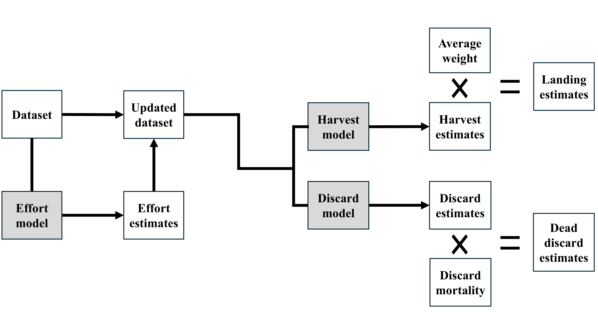
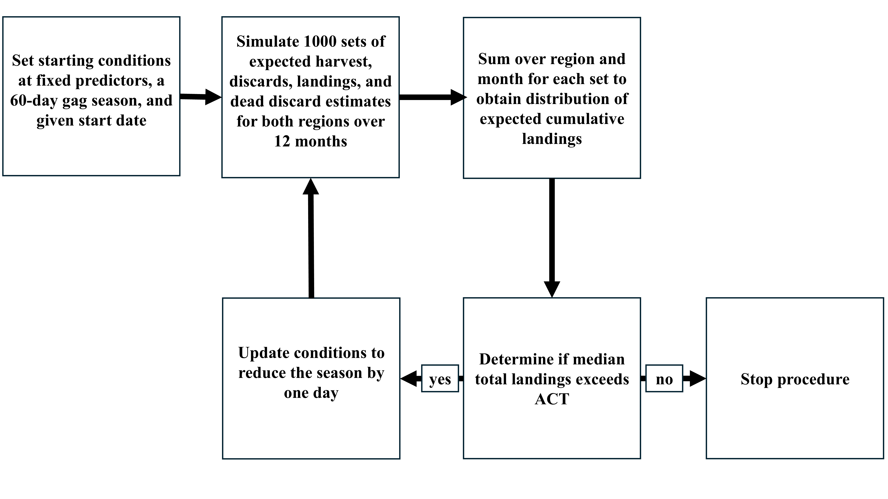
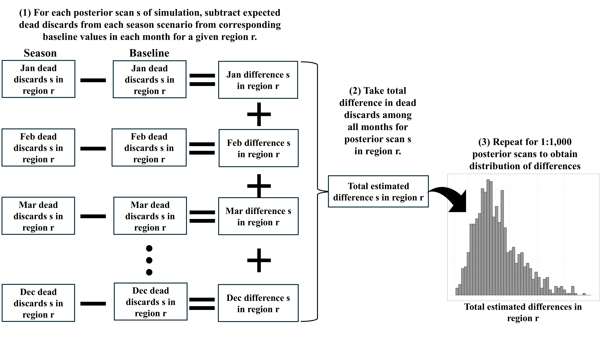

<style>
body {
  font-family: Serif;
  font-size: 12pt;
}

/* Headers */
h1{
  font-size: 20pt;
  font-family: Serif;
}
h2{
  font-size: 18pt;
  font-family: Serif;
}
h3{
  font-size: 16pt;
  font-family: Serif;
}
h4{
  font-size: 14pt;
  font-family: Serif;
}
p.caption {
  font-size: 0.8em;
}
</style>

# Overview
This file contains all code used to produce figures in *Take it or leave it: influence of environmental and management variables on harvest and discard rates in a multispecies fishery; a case study with gag (Mycteroperca microlepis)*. Files are pulled directly from the online respositories of this paper and its companion paper, [Modeling effort in a multispecies recreational fishery; influence of species-specific temporal closures, relative abundance, and seasonality on monthly angler-trips](https://doi.org/10.1016/j.fishres.2024.107136). 

# Load and format data
The following code loads required packages and data. Formatting is annotated throughout.
```{r, echo = T}
knitr::opts_chunk$set(warning = FALSE, message = FALSE,fig.width=15, fig.height=10)
#------------------------------------------------------------------------------#
##################################### Libraries ################################
#------------------------------------------------------------------------------#
## Syntax packages
suppressMessages(library(dplyr))
suppressMessages(library(tidyr))
suppressMessages(library(tidyverse))
suppressMessages(library(lubridate))

## Visualization packages
suppressMessages(library(ggplot2))
suppressMessages(library(ggrepel))
suppressMessages(library(xtable))
suppressMessages(library(kableExtra))
options(width = 80)
suppressMessages(library(grid))
suppressMessages(library(ggpubr))
suppressMessages(library(RColorBrewer))

## Modeling
suppressMessages(library(brms))
suppressMessages(library(forecast))

## File reading
suppressMessages(library(readxl))
#------------------------------------------------------------------------------#
##################################### Housekeeping #############################
#------------------------------------------------------------------------------#
## Clear out old files in R
rm(list=ls(all=TRUE)) 

## Set working directory (set to wherever you store the files)
setwd("C:\\Users\\ichal\\Documents\\Hyman gag grouper models\\Hyman et al 2024b")

## Add helper functions from source file on Github
source("https://raw.githubusercontent.com/ChallenHymanPhD/Hyman-et-al-2024-Harvest/R-Files/Hyman%20et%20al%202024%20Harvest%20and%20Discard%20helper%20functions.R")

## set themes for plotting
theme_set(My_theme())

#------------------------------------------------------------------------------#
##################################### Load data ################################
#------------------------------------------------------------------------------#
## All MRIP data for analysis
### Note: for aggregation files see https://github.com/ChallenHymanPhD/Hyman-et-at-2024-Effort
All_Data <- read.csv("https://raw.githubusercontent.com/ChallenHymanPhD/Hyman-et-al-2024-Harvest/Data-Files/MRIP%20Effort%20and%20Catch%20data.csv")

## Mortality estimates from Sauls 2014 (https://doi.org/10.1016/j.fishres.2013.10.008)
Mortality <- read.csv("https://raw.githubusercontent.com/ChallenHymanPhD/Hyman-et-al-2024-Harvest/Data-Files/Sauls%202014%20Mortality.csv") 

## Effort model from Hyman et al 2024
download.file("https://raw.githubusercontent.com/ChallenHymanPhD/Hyman-et-at-2024-Effort/Data-Files/Effort_Model.rds","Effort_Model.rds", method = 'curl')
Effort_Model <- readRDS("Effort_Model.rds")

#------------------------------------------------------------------------------#
################################### Format data ################################
#------------------------------------------------------------------------------#
All_Data <- All_Data%>%group_by(year, Region)%>%                                ## Create lagged index of abundance for Harvest and discard models
  mutate(Index_Gag = CPUE_Gag_lag,
         CPUE_Gag_lag_annual = mean(CPUE_Gag_lag, na.rm = T))                   ## Mean is used to replace NA values


All_Data$Date <- as.Date(All_Data$Date)                                         ## Format dates
All_Data$Income <- All_Data$Income/1e4                                          ## Income variable is only for effort model (see https://doi.org/10.1016/j.fishres.2024.107136)

All_Data$Index_Gag <- All_Data$Index_Gag+0.001                                  ## Add small constant to lagged index to avoid non-finite values after log transformation

## Replace NA index values with region-and year-specific mean CPUE (only 5 instances total)
All_Data$Index_Gag[which(is.na(All_Data$Index_Gag))] <- All_Data$CPUE_Gag_lag_annual[which(is.na(All_Data$Index_Gag))]

## Small correction to dataset (Gag season open in 4 county region in Big Bend in 2012 in addition to 2013-2022:
## https://www.woodsnwater.net/blogs/news/faq-2012-recreational-gulf-gag-grouper-season-changes#:~:text=Harvest%20and%20possession%20of%20gag,April%201%20through%20June%2030)
All_Data$M_Gag[which(All_Data$Region=="Panhandle" & All_Data$Date %in% as.Date(c("2012-04-01", "2012-05-01", "2012-06-01")))] <- 1

All_Data <- All_Data[which(All_Data$year<2024 & All_Data$year>2003),]           ## Subset data to desired years for analysis

## Removes four crazy outliers
All_Data <- All_Data[-which(All_Data$Region=="Panhandle" & 
                              All_Data$Date %in% c(as.Date("2005-04-01"), as.Date("2013-10-01"), as.Date("2004-10-01"), as.Date("2010-11-01"))),]

```

# Models
The following code runs the harvest and discard models. 

## Harvest
Estimates of monthly harvest derived from the MRIP survey design were continuous with a lower bound of zero. In addition, multiple monthly harvest estimates were zero, particularly when the gag season was closed. To account for these characteristics, we employed a Hurdle-Gamma (HG) generalized linear model to analyze gag harvest ($H$). The hurdle model has a probability mass function specified separately for zero and a probability density function for positive outcomes. The conditional density function for the HG probability distribution is used to describe the distributional forms:

\[HG(H|\pi, \phi, \delta) = \begin{cases} 
\delta, &y = 0\\
(1-\delta)\text{Gamma}(H|\pi, \phi),&y \ge 0 \end{cases}\]

where $\delta$ is the probability of observing zero gag harvest and $\text{Gamma}(H|\pi, \phi)$ is the Gamma probability density function such that:
\[\text{Gamma}(y|\pi,\phi) =
\frac{\pi^{\tau}}      {\Gamma(\phi)} \, H^{\phi - 1}
\exp(-\pi \, y),\qquad y \ge 0 \]

Here, $\pi$ denotes the inverse-scale parameter, and $\phi$ denotes the shape parameter, and $\Gamma(\cdot)$ denotes the Gamma function. The mean of the Gamma distribution, $\lambda$ can be expressed as $\lambda = \frac{\phi}{\pi}$. Consequently, the model for gag harvest is expressed as:
$$
\begin{aligned}
\text{H}_{t} &\sim HG(\pi_{t}, \phi_{t}, \delta_{t})\\
&\pi_{t} = \frac{\phi_{t}}{\lambda_{t}}\nonumber\\
&\lambda_{t} = exp\bigg(\omega_0 + \sum_{u=1}^U{e_{t,u}\omega_{u}}\bigg)\\
&\phi_{t} = exp\bigg(\nu_0 + \sum_{j=1}^J{w_{t,j}\nu_{j}}\bigg)\\
&\delta_{t} = \frac{1}{1+exp(\gamma_0 +\sum_{l=1}^L{b_{t,l}\gamma_{l}})}
\end{aligned}
$$
where $\text{H}_{t}$ denotes the gag harvest in the $t^{th}$ month-year-region. Meanwhile, $\lambda_{t}$ and $\phi_t$ denote the mean and shape of the Gamma distribution conditioned on $\text{H}_{t} > 0$ (i.e., at least on gag harvested), respectively, and $\delta_{t}$ denotes the binomial probability of observing 0 gag harvest in region-month-year $t$. Here, $\lambda_{t}$ was related to a set of $U$ predictors ($e_{t,1}, \dots, e_{t,U}$) using a log link function and set of regression coefficients $\omega_{1}, \dots, \omega_{U}$. Predictors considered in modeling $\lambda_{t}$ included region, the fraction of a month open to gag harvest, the fraction of a month open to red snapper harvest, recreational and juvenile indices of abundance, angler-trips, sea-surface temperature, and harmonic terms. The shape parameter $\phi_{t}$ was related to a set of $J$ predictors ($w_{t,1}, \dots, w_{t,J}$) also using a log link function and regression coefficients $\nu_{1}, \dots, \nu_{J}$. We considered region and harmonic terms as predictors to model $\phi_t$. Finally, $\delta_t$ was related to a set of $L$ predictors ($b_{t,1}, \dots, b_{t,J}$) and coefficients $\gamma_0, ... \gamma_L$ through a logit link. We modeled $\delta_t$ as a function of region and whether the gag season was open (at least one day open) or closed (no days open) in a given month.
```{r, echo = T}
#------------------------------------------------------------------------------#
## Set training and testing data
set.seed(9876)
Test_data <- sample(1:nrow(All_Data), 50, replace = F)

Test <- All_Data[Test_data,]
Train <- All_Data[-Test_data,]

#------------------------------------------------------------------------------#
## Generally weakly informative priors for both models
Hyman_prior <- c(prior(normal(0,10), class = Intercept),
                 prior(normal(0,10), class = b),
                 prior(normal(0,10), class = Intercept, dpar = shape),
                 prior(normal(0,10), class = Intercept, dpar = hu),
                 prior(normal(0,10), class = b, dpar = hu))
#------------------------------------------------------------------------------#
Harvest_Model <- brm(                                                       
    bf(Harvest_Gag ~                                                            ## Models mean of gamma distribution
         Region*log(Index_Gag) +                                                ## CPUE index of abundance in a given region and month from previous year
         Region*log(Juveniles) +                                                ## Juvenile index of abundance (annual resolution for whole state)
         Region*sin1 +                                                          ## Harmonic terms (sin1 = annual sinusoidal term, sin2 = semi-annual sinusoidal term, etc) 
         Region*cos1 + 
         Region*sin2 + 
         Region*cos2 + 
         Region*SST +                                                           ## Sea-surface temperature
         Region*M_Gag +                                                         ## Fraction of month open to gag harest
         Region*M_RS +                                                          ## Fraction of month open to red snapper harest
         Region*log(Trips),                                                     ## log-effort                              
       hu ~ Region*ceiling(M_Gag),                                              ## Models hurdle component: Region-specific binary term denoting whether gag was open in a given month/region (at least one day open)
       shape ~ Region*sin1 +                                                    ## Models gamma shape parameter as functin of harmonic terms and gag index of abundance                                               
         Region*cos1 + 
         Region*sin2 + 
         Region*cos2 +
         Region*log(Index_Gag)), data = Train,                            
    family = hurdle_gamma(), 
    chains = 4, prior = Hyman_prior)
#------------------------------------------------------------------------------#
```


## Discards
Similar to harvest, we modeled discards using a Hurdle-Gamma generalized linear model. Note that we employ separate terms for hurdle, inverse-scale, mean, and shape parameters to distinguish between the harvest and discard models. Here, $\theta$ is the binomial probability of observing a 0, while $\iota$, $\eta$, and $\tau$ denote the discard inverse-scale parameter, mean, and shape parameters, respectively. The complete model for gag discards is therefore expressed as:
$$
\begin{aligned}
\text{D}_{t} &\sim HG(\iota_{t}, \tau_{t}, \theta_{t})\\
& \iota_{t} = \frac{\tau_{t}}{\eta_{t}}\nonumber\\
& \eta_{t} = exp\bigg(\psi_0 +\sum_{i=1}^Ik_{t,i}\psi_{i}\bigg)\nonumber\\
& \tau_{t} =  exp\bigg(\zeta_0 +\sum_{s=1}^S{z_{t,s}}\zeta_{s}\bigg)\nonumber\\
& \theta_{t} = \frac{1}{1+exp(\xi_0 +\sum_{a=1}^A{g_{t,a}\xi_{a}})}\nonumber
\end{aligned}
$$

where $\text{D}_{t}$ denotes the gag discards observed in the $t^{th}$ region-month-year. Similar to the harvest model formulation, $\theta_{t}$ is related to a set of $A$ linear predictors ($g_{t,1}, \dots, g_{t,A}$) and corresponding coefficients ($\xi_{1}, \dots, \xi_{A}$) through a logit link. Here, $\theta$ was modeled as a function of region and the recreational gag index of abundance from the previous year. Subsequently, $\eta_{t}$ was related to a separate set of $I$ linear predictors ($k_{t,1}, \dots, k_{t,I}$) and corresponding coefficients $\psi_{1}, \dots, \psi_{I}$ through the log link. Finally, we posited that the shape parameter $\tau_{t}$ was a function of ($z_{t,1},...,z_{t,S}$) predictors and related coefficients $\zeta_{s}$ also through a log-link. The predictors we considered in modeling $\eta$ and $\tau$ were identical to those considered in modeling $\lambda$ and $\phi$, respectively in the harvest model.
```{r, echo = T}
Discard_Model <- brm(                                                       
    bf(Discard_Gag ~                                                            ## Models mean of gamma distribution
         Region*log(Index_Gag) +                                                ## CPUE index of abundance in a given region and month from previous year
         Region*log(Juveniles) +                                                ## Juvenile index of abundance (annual resolution for whole state)
         Region*sin1 +                                                          ## Harmonic terms (sin1 = annual sinusoidal term, sin2 = semi-annual sinusoidal term, etc) 
         Region*cos1 + 
         Region*sin2 + 
         Region*cos2 + 
         Region*SST +                                                           ## Sea-surface temperature
         Region*M_Gag +                                                         ## Fraction of month open to gag harvest
         Region*M_RS +                                                          ## Fraction of month open to red snapper harvest
         Region*log(Trips),                                                     ## log-effort                                                              
       hu ~ Region*log(Index_Gag),                                              ## Models hurdle component: Region-specific gag index of abundance    
       shape ~ Region*sin1 +                                                    ## Models gamma shape parameter as function of harmonic terms and gag index of abundance                                               
         Region*cos1 + 
         Region*sin2 + 
         Region*cos2 +
         Region*log(Index_Gag)), data = Train,                            
    family = hurdle_gamma(), 
    chains = 4, prior = Hyman_prior)
```


# Simulations
## Procedure
A major objective of the present study was to forecast how changes in management may impact gag harvest, discards, and dead discards. To this end, we developed counterfactual simulations based on differing recreational gag season start dates. However, species-specific management actions influence various aspects of angler behavior, extending beyond just harvest and discard rates. One significant factor affected is angler effort. As a result, information on angler effort was essential for estimating gag harvest and discards within our modeling framework. To accurately assess the overall impact of different management actions on gag harvest and discards, it was therefore important to account for changes in effort. Consequently, we developed a simulation framework to using the harvest and discard models devised here in conjunction with the recreational reef fish effort model devised in [Hyman et al. 2024](https://doi.org/10.1016/j.fishres.2024.107136) to estimate effort, harvest, and discards. 

```{r, echo=FALSE, fig.cap="Conceptual diagram of the procedure used to simulate expected harvest, landings, discards, and dead discards using supplied counterfactual data in conjunction the harvest and discard models as well as the effort model from [Hyman et al. 2024](https://doi.org/10.1016/j.fishres.2024.107136). Sequential steps in the procedure are as follows: (1) generate a set of effort estimates using a supplied dataset and effort model; (2) append effort estimates to supplied dataset; (3) generate set of expected harvest and discard estimates using the updated dataset, harvest model, and discard model; (4) harvest estimates are multiplied by average weight to obtain landings estimates, while discard estimates are multiplied by discard mortality to obtain dead discards. This process was repeated iteratively 1000 times, each with a different set of posterior scans from the effort, harvest, and discard models."}
download.file("https://raw.githubusercontent.com/ChallenHymanPhD/Hyman-et-al-2024-Harvest/Data-Files/Hyman%20Flow%20Chart%201.png","Hyman Flow Chart 1.png", mode = "wb")

```

The framework was a multi-step process, whereby first we simulated a set of expected effort estimates based on a supplied counterfactual dataset. These effort estimates were subsequently appended to the counterfactual dataset. To propagate uncertainty through all models, we first extracted posterior predictions of expected effort using the model presented in [Hyman et al. 2024](https://doi.org/10.1016/j.fishres.2024.107136) as a function of covariates from the counterfactual datasets using 1,000 posterior scans from the joint posterior distribution of the effort model. The effort model in [Hyman et al. 2024](https://doi.org/10.1016/j.fishres.2024.107136) is gamma-distributed, whereby the expectation is the mean value $\mu$. Hence, for each posterior scan $s$ in counterfactual $n \in \{\text{Base}, \text{Jun}, \text{Sep}, \text{Nov}\}$, region-month $o$, we estimated the posterior predictive draw of expected effort ($E[\hat{F}^{(s)}_{n,o}$]) as:
$$
\begin{aligned}
 E[\hat{F}^{(s)}_{n,o}] &= \mu_{n,o} = exp \bigg(\beta^{(s)}_0 + \sum_{p=1}^P{x_{{n,o},p}\beta^{(s)}_p}\bigg)\nonumber
\end{aligned}
$$
Note that the notation presented here is consistent with notation provided in [Hyman et al. 2024](https://doi.org/10.1016/j.fishres.2024.107136), where, $\mu_{n,o}$ denotes mean effort in counterfactual $n$, region-month $o$. The ln mean $\mu_{n,o}$ is linearly related to an intercept ($\beta_0$) and set of $P$ linear predictors ($x_{n,o,1}, \dots, x_{n,o,P}$) and corresponding coefficients ($\beta_{1}, \dots, \beta_{P}$. See [Hyman et al. 2024](https://doi.org/10.1016/j.fishres.2024.107136) for details on predictors included in the effort model. This resulted in a $24 \times 1,000$ matrix of expected effort estimates for each season scenario (i.e., 1,000 sets of expected effort estimates for each month in each region). 


Next, for each posterior scan $s$, we appended the counterfactual dataset with posterior predictive effort estimates derived from the effort model (i.e., $E[\hat{F}^{(s)}_{n,o}]$) to generate estimates of expected harvest and discards. Consequently, the design matrices used in estimating the nonzero mean parameters in the harvest and discard models changed with each posterior scan (due to updating effort estimates iteratively). The expected value in a hurdle-gamma distribution is the product of the probability of obtaining a nonzero outcome and the mean of the gamma distribution. Therefore, expected harvest and discard estimates for posterior scan $s$ in region-month $o$ for a given season scenario $n$ were calculated as:

$$
\begin{aligned}
E[\hat{H}^{(s)}_{n,o}] &= (1-\delta^{(s)}_{n,o})(\lambda^{(s)}_{n,o})\nonumber\\
&\lambda^{(s)}_{n,o} = exp\bigg(\omega^{(s)}_0 +\sum_{u=1}^U\hat{e}^{(s)}_{n,o,u}\omega^{(s)}_{i}\bigg)\nonumber\\
& \delta^{(s)}_{n,o} = \frac{exp(\gamma^{(s)}_0+\sum_{l=1}^L{b_{n,o,l}\gamma^{(s)}_{a}})}{1+exp(\gamma^{(s)}_0+\sum_{l=1}^L{b_{no,l}\gamma^{(s)}_{a}})}\nonumber\\
\nonumber\\
E[\hat{D}^{(s)}_{n,o}] &= (1-\theta^{(s)}_{n,o})(\eta^{(s)}_{n,o})\nonumber\\
& \eta^{(s)}_{n,o} = exp\bigg(\psi^{(s)}_0 +\sum_{l=1}^L\hat{k}^{(s)}_{n,o,i}\psi^{(s)}_{i}\bigg)\nonumber\\
& \theta^{(s)}_{n,o} = \frac{exp(\xi^{(s)}_0+\sum_{a=1}^A{g_{n,o,a}\xi^{(s)}_{a}})}{1+exp(\xi^{(s)}_0+\sum_{a=1}^A{g_{n,o,a}\xi^{(s)}_{a}})}\nonumber
\end{aligned}
$$


Finally, harvest estimates were multiplied by the average weight in each region and month ($\text{Weight}_{o}$) to obtain a landings estimate (pounds), while discard estimates in a given month and region were multiplied by corresponding mean discard mortality estimates ($\text{Mortality}_{o}$) derived from [Sauls 2014](https://doi.org/10.1016/j.fishres.2013.10.008):

$$
\begin{aligned}
\text{Landings}^{(s)}_{n,o} &= E[\hat{H}^{(s)}_{n,o}] \cdot \text{Weight}_{o}\nonumber\\
\text{Dead}^{(s)}_{n,o} &= E[\hat{D}^{(s)}_{n,o}] \cdot \text{Mortality}_{o}\nonumber
\end{aligned}
$$
Counterfactual design matrices using three recreational gag season beginning in June, September, and November. For these counterfactual design matrices, all non-management variables were fixed at region- and month-specific averages values from years 2021 to 2023 except the juvenile gag index of abundance, which was fixed at the 2022 value due to lack of more recent data. The red snapper season was fixed at the Florida 2024 season (July 16^th^ to July 31^st^ and weekends between September and November 1^st^). Estimation of gag management variables (e.g., the fraction of each month open to gag harvest) required information on the length of the recreational gag season. However, recreational season lengths are typically based on projections of when the ACT will be exceeded. Given that gag harvest rates vary seasonally, the length of any gag recreational season depends on the season start date. Therefore, to determine the appropriate season length for each counterfactual start date scenario, we employed an iterative approach where initially we set starting conditions to fixed predictor values and a 60 day season. We iteratively reduced the gag recreational season length until the median cumulative landings estimate was less than or equal to a simulated ACT. 

```{r, echo=FALSE, fig.cap="Conceptual diagram of the procedure used to estimate season length for a given counterfactual scenario based on a prespecified ACT and season start date."}
download.file("https://raw.githubusercontent.com/ChallenHymanPhD/Hyman-et-al-2024-Harvest/Data-Files/Hyman%20Flow%20Chart%202.png","Hyman Flow Chart 2.png", mode = "wb")

```


For a given season start date, the gag season length corresponding to total landings equal to or just below the ACT was used to calculate gag management variables in the counterfactual design matrix. Finally, as a baseline for comparison, we also included a ''no season'' scenario to determine the monthly expected discards and dead discards if the gag season was not opened (herein referred to as the baseline). For each counterfactual season start date, we simulated seasons based on a recreational ACT of 635,364 lbs gutted weight (gw), which roughly aligned with recreational ACL values and a 10% buffer for 2025 in the [current rebuilding plan](https://www.fisheries.noaa.gov/s3//2023-06/RF56-Gag-Rebuilding-Plan-Final-508-06272023.pdf). After estimating the median expected season length for each scenario, we subsequently simulated 1,000 expected dead discard estimates for each month and region.

```{r}
## Set starting values
Year <- 2024
Gag_Start <- c("No Season", "June 01", "September 01", "November 01")           ## Gag season start dates for counterfactual scenarios (including baseline)
ACT <-  333000*0.9*2.12                                                         ## ACL converted from SRFS units to MRIP-FES units with 10% buffer for ACT
RS_Season <- c("June 01", "July 31")                                            ## 2024 Florida Red Snapper season (https://myfwc.com/fishing/saltwater/recreational/snappers/#:~:text=Gulf%20Recreational%20Red%20Snapper,30.)
RS_Season2 <- c("September 01", "November 30")                                  ## Dates red snapper was reopened in Florida
RG_Season <- c("Jan 01", "June 30")                                             ## 2024 red grouper season (https://myfwc.com/news/all-news/red-grouper-524/)
RG_Season2 <- NULL                                                              ## Red grouper season did not re-open
N <- 1000                                                                       ## Number of iterations to run simulation

#------------------------------------------------------------------------------#
## Create fixed counterfactual data
Data <- All_Data[order(All_Data$Region, All_Data$Date),]                        ## Order Data
Start <- paste0(Year,'-01-01')                                                  ## Start
End <- paste0(Year,'-12-01')                                                    ## End

## Time and Region variables
Month <- rep(seq.Date(as.Date(Start), as.Date(End), by = 'month'),2)
Region <- sort(rep(unique(Data$Region),12))

## Environmental variables
## Sea-surface temperature
SST <- Data%>%
  filter(year >2020)%>%
  group_by(month, Region)%>%
  summarize(mean(SST))%>%.[order(.$Region, .$month),3]%>%unlist()%>%as.vector()

## Wind (used effort model in Hyman et al. 2024)
Wind <-Data%>%
  filter(year >2020)%>%
  group_by(month, Region)%>%
  summarize(mean(Wind))%>%.[order(.$Region, .$month),3]%>%unlist()%>%as.vector()

## Economic variables (used effort model in Hyman et al. 2024)
FIR <- Data$FIR[(nrow(Data)-11):nrow(Data)]
Sales <- Data$Sales[(nrow(Data)-11):nrow(Data)]

## Harmonic regression terms
## Set periods manually
per <- 365                                                                      ## Period 1 is annual (365 days in a year)
per2 <- 182.5                                                                   ## Period 2 is semi-annual (182.5 days every six months)

#------------------------------------------------------------------------------#
## Index variables
## Gag
CPUE_Gag <- Data%>%                                                             
  filter(year >2020)%>%
  group_by(month, Region)%>%
  summarize(mean(CPUE_Gag))%>%.[order(.$Region, .$month),3]%>%unlist()%>%as.vector()

## Red Grouper
CPUE_RG  <- Data%>%                                                             
  filter(year >2020)%>%
  group_by(month, Region)%>%
  summarize(mean(CPUE_RG))%>%.[order(.$Region, .$month),3]%>%unlist()%>%as.vector()

## Red Snapper
CPUE_RS  <- Data%>%                                                             
  filter(year >2020)%>%
  group_by(month, Region)%>%
  summarize(mean(CPUE_RS))%>%.[order(.$Region, .$month),3]%>%unlist()%>%as.vector()  

## Juvenile gag index
Juveniles <- ((Data$Juveniles))[which(Data$year == Year-1)]                    

## Gag Weight
Weight_Gag <- Data%>%
  filter(year >2020)%>%
  group_by(month, Region)%>%
  summarize(mean(Weight_Gag, na.rm = T))%>%
  .[order(.$Region, .$month),3]%>%unlist()%>%as.vector()
Weight_Gag[which(is.na(Weight_Gag))] <- 0                                       ## Replace NA values with 0s (because gag has not been harvested in any closed month in last 3 years anyway)

## Gag seasonal live release mortality
LRM_Gag <- Mortality$Mortality

#------------------------------------------------------------------------------#
## Fixed management variables
## Red Snapper
M_RS <- Season_Month_Fraction(Year = Year,                                      ## Creates fraction of month open to red snapper harvest
                              Season = RS_Season,
                              Additional = RS_Season2,
                              Additional_KOD = "weekend")[[1]]$Open
S_RS <- Season_Month_Fraction(Year = Year,                                      ## Calculates number of days in red snapper season
                              Season = RS_Season,
                              Additional = RS_Season2,
                              Additional_KOD = "weekend")[[2]]
S_RSL <- M_RS*log(S_RS)                                                         ## Red snapper effort concentration variable

## Red Grouper (for CPUE variable in Hyman et al. 2024 effort model)
M_RG <- Season_Month_Fraction(Year = Year,                                      ## Creates fraction of month open to red grouper harvest
                              Season = RG_Season,
                              Additional = NULL,
                              Additional_KOD = "weekend")[[1]]$Open 
```

## Simulation code
The following code runs the simulation for each of the three season scenarios outlined above.
```{r}
## Create data frames to hold all simulations
Complete_Harvest <- NULL
Complete_Discards <- NULL
Complete_Dead_Discards <- NULL
Complete_Landings <- NULL
for (Season_Start in Gag_Start){                                                ## For each of of the four season scenarios (including the baseline)
  for (d in 60:1){                                                              ## Begin at 60 day seasons and iteratively reduce until landings are at or below threshold
    if(Season_Start == "No Season"){                                            ## For baseline "no season" scenario, set fraction of month open to gag at 0
      M_Gag <- 0; S_Gag <- 1; 
      Gag_Season <- "No Season"} 
    else {
      Gag_Season <- c(Season_Start,paste(format(as.Date(Season_Start, "%B %d")  ## If not the baseline, add number of days in season (d) to season start value to get season length
                                                + d, "%B %d")))
      ## Obtain gag management variables based on simulated season
      M_Gag <- Season_Month_Fraction(Year = Year,                               ## Fraction of each month open to gag harvest
                                     Season = Gag_Season,Additional = NULL)[[1]]$Open        
      S_Gag <- Season_Month_Fraction(Year = Year,                               ## Season duration variable
                                     Season = Gag_Season,Additional = NULL)[[2]]
    }
    ## Construct counterfactual data frame
    Counterfactual <- data.frame(Wind = Wind,                                   ## For effort model
                                 SST = SST,                                     ## For harvest/discard models
                                 Date = Month,                                  ## For all models
                                 Region = Region,                               ## For all models
                                 Juveniles = Juveniles,                         ## For harvest/discard models
                                 FIR=FIR,                                       ## For effort model
                                 LRM = LRM_Gag,                                 ## To calculated dead discards
                                 Index_Gag = CPUE_Gag+0.001,                    ## For harvest/discard models; note small constant added to avoid 0s in log transformation
                                 CPUE_Gag_lag = CPUE_Gag*M_Gag,                 ## For effort model
                                 CPUE_RG_lag = CPUE_RG*M_RG,                    ## For effort model
                                 CPUE_RS_lag = CPUE_RS*M_RS,                    ## For effort model
                                 Weight_Gag = Weight_Gag,                       ## To convert monthly harvest in numbers to landings in pounds
                                 M_RG = M_RG,                                   ## For all models
                                 M_RS = M_RS,                                   ## For all models
                                 S_RSL = S_RSL,                                 ## For all models
                                 M_Gag = M_Gag,                                 ## For all models
                                 S_GagL = M_Gag*log(S_Gag),                     ## For all models
                                 Sales = Sales,                                 ## For effort model
                                 Scenario = Gag_Season)%>%
      mutate(Time = as.POSIXlt(Date)$yday,
             sin1 = sin(2*pi/per*Time),                                         ## Add harmonic terms (for all models)
             cos1 = cos(2*pi/per*Time),
             sin2 = sin(2*pi/per2*Time),
             cos2 = cos(2*pi/per2*Time)
      )
    
    ## Step 1) Extract posterior predictions for Effort
    Effort_preds <- posterior_epred(Effort_Model, Counterfactual, ndraws = N)   ## Compute reef effort expectation based on conditions in simulation
    
    ## Step 2) Extract model coefficients
    Harvest_terms <- as_draws_matrix(Harvest_Model)%>%as.data.frame()           ## Harvest model terms
    omega <- Harvest_terms[,-c(grep("b_shape_", colnames(Harvest_terms)),grep("b_hu_", colnames(Harvest_terms)))]%>%.[-ncol(.)]%>%.[,-ncol(.)]
    gamma <- Harvest_terms[,grep("b_hu_", colnames(Harvest_terms))]
    nu <- Harvest_terms[,grep("b_shape_", colnames(Harvest_terms))]
    
    Discard_terms <- as_draws_matrix(Discard_Model)%>%as.data.frame()           ## Discard model terms
    psi <- Discard_terms[,-c(grep("b_shape_", colnames(Discard_terms)),grep("b_hu_", colnames(Discard_terms)))]%>%.[-ncol(.)]%>%.[,-ncol(.)]
    zeta <- Discard_terms[,grep("b_hu_", colnames(Discard_terms))]
    xi <- Discard_terms[,grep("b_shape_", colnames(Discard_terms))]
    
    ## Data frames to hold values
    Discard_preds <- matrix(NA, nrow = N, ncol = nrow(Counterfactual))                  
    Harvest_preds <- matrix(NA, nrow = N, ncol = nrow(Counterfactual))
    Dead_Discard_preds <- matrix(NA, nrow = N, ncol = nrow(Counterfactual))    
    Removals_preds <- matrix(NA, nrow = N, ncol = nrow(Counterfactual))  
    Landings_preds <- matrix(NA, nrow = N, ncol = nrow(Counterfactual))  
    
    ## Loop to pull predictions from correlated model draws
    for (i in 1:N){                                                             ## For each of the 1000 simulations
      ## Model matrices for predictions
      Test_iter <- Counterfactual                                               ## Create temporary data frame for effort updating
      Test_iter$Trips <- (Effort_preds[i,])                                     ## Update design matrix with effort estimates from model predictions iteratively
      
      #--------------------------- Harvest ------------------------------------#
      omega_MM <- model.matrix(~Region*log(Index_Gag) +                         ## Design matrix for mean component of gag harvest based on fixed values, and set management conditions
                                 Region*log(Juveniles) + 
                                 Region*sin1 + 
                                 Region*cos1 + 
                                 Region*sin2 + 
                                 Region*cos2 + 
                                 Region*SST + 
                                 Region*M_Gag +
                                 Region*M_RS + 
                                 Region*log(Trips), data = Test_iter)
      gamma_MM <- model.matrix(~Region*M_Gag, data = Test_iter)                 ## Design matrix for hurdle component of gag HPUE based on fixed values, and set management conditions
      nu_MM <- model.matrix(~Region*sin1 + 
                              Region*cos1 + 
                              Region*sin2 + 
                              Region*cos2 +
                              Region*log(Index_Gag), data = Test_iter)          ## Design matrix for shape component of gag HPUE based on fixed values
      lambda <- exp(as.matrix(omega_MM)%*%t(as.matrix(omega[i,])))              ## Compute lambda (harvest nonzero mean) using posterior scan of coefficients and design matrix
      phi <- exp(as.matrix(nu_MM)%*%t(as.matrix(nu[i,])))                       ## Compute phi (harvest shape) using posterior scan of coefficients and design matrix
      delta <- plogis(as.matrix(gamma_MM)%*%t(as.matrix(gamma[i,])))            ## Compute delta (harvest hurdle) using posterior scan of coefficients and design matrix
      Harvest_preds[i,] <- (1-delta)*lambda;                                    ## Compute gag harvest expectation
      
      #--------------------------- Discards -----------------------------------#
      eta_MM <- model.matrix(~Region*log(Index_Gag) +                           ## Create discard model design matrix
                                   Region*log(Juveniles) + 
                                   Region*sin1 + 
                                   Region*cos1 + 
                                   Region*sin2 + 
                                   Region*cos2 + 
                                   Region*SST + 
                                   Region*M_Gag +
                                   Region*M_RS+
                                   Region*log(Trips), data = Test_iter)                                       
      theta_MM <- model.matrix(~Region*log(Index_Gag), data = Test_iter)        ## Design matrix for hurdle component of gag discards based on fixed values, and set management conditions
      eta <- exp(as.matrix(eta_MM)%*%t(as.matrix(psi[i,])))                     ## Compute eta (discard nonzero mean) using posterior scan of coefficients and design matrix
      theta <- plogis(as.matrix(theta_MM)%*%t(as.matrix(zeta[i,])))             ## Compute theta (discard hurdle) using posterior scan of coefficients and design matrix
      Discard_preds[i,] <- (1-theta)*eta;                                       ## Compute gag discard expectation
      
      
      Dead_Discard_preds[i,] <- Discard_preds[i,]*Test_iter$LRM                 ## Compute expected dead discards as product of live releases and discard mortality
      Removals_preds[i,] <- Harvest_preds[i,] + Dead_Discard_preds[i,]          ## Compute expected total removals as sum of expected harvest and expected dead discards
      Landings_preds[i,] <- Harvest_preds[i,]*Test_iter$Weight_Gag*2.205/1.12   ## Compute numbers to landings in pounds and adjust for gutted weight 
    }
    
    ## Calculate pseudo-posterior distribution of cumulative landings
    Landings <- Landings_preds%>%t()%>%as.data.frame()
    Landings$Date <- as.Date(Counterfactual$Date)
    Landings$Region <-Counterfactual$Region
    Landings <- Landings%>%group_by(Date)%>%                                    ## Sum across regions
      summarize(across(1:N, list(sum)))
    Landings_cum <- Landings%>%                                                 ## compute cumulative sum for each of the 1000 scans
      summarize(across(2:(N+1), list(cumsum)))
    Landings_cum$Date <- as.Date(rep(Month[1:12],1))                            ## Add months (honestly not important)
    
    ## Obtain median and 80% CI for cumulative landings sums
    Landings_cum$Q10 <- apply(Landings_cum[,1:(N)], 1, function(x){quantile(x, 0.1, na.rm = T)})
    Landings_cum$Q50 <- apply(Landings_cum[,1:(N)], 1, function(x){quantile(x, 0.5, na.rm = T)})
    Landings_cum$Q90 <- apply(Landings_cum[,1:(N)], 1, function(x){quantile(x, 0.9, na.rm = T)})
    if(Landings_cum$Q50[12] <= ACT || Season_Start == "No Season"){             ## If median total landings fall below ACT, stop simulation for that season start date
      break                                                                     ## Otherwise reduce season by one day and repeat
    } 
  }
  
  #------------------------ Format estimates ----------------------------------#
  ## For each matrix of posterior predictive quantities, convert to data frame 
  ## and add counterfactual information on scenario, date, and region
  
  if(Season_Start == "No Season"){                                              ## For baseline scenario, set name without number of days in season (because it will be 0)
    Season_scenario <- "No season (baseline)"
    } else {
    Season_scenario <- paste0(Season_Start," (",d," days)")                     ## For all other scenarios, append number of days to season name
  }
  ## Harvest posterior predictive quantities
  Harvest <- Harvest_preds%>%t()%>%as.data.frame()
  Harvest$Date <- as.Date(Counterfactual$Date)                                  ## Add date
  Harvest$Region <-Counterfactual$Region                                        ## Add Region
  Harvest$Scenario <- Season_scenario                                           ## Add scenario name
  
  ## Discard posterior predictive quantities
  Discards <- Discard_preds%>%t()%>%as.data.frame()
  Discards$Date <- as.Date(Counterfactual$Date)                                 ## Add date
  Discards$Region <-Counterfactual$Region                                       ## Add Region
  Discards$Scenario <- Season_scenario                                          ## Add scenario name
  
  ## Dead discard posterior predictive quantities
  Dead_Discards <- Dead_Discard_preds%>%t()%>%as.data.frame()
  Dead_Discards$Date <- as.Date(Counterfactual$Date)                            ## Add date
  Dead_Discards$Region <-Counterfactual$Region                                  ## Add Region
  Dead_Discards$Scenario <- Season_scenario                                     ## Add scenario name
  
  ## Landings posterior predictive quantities
  Landings <- Landings_preds%>%t()%>%as.data.frame()
  Landings$Date <- as.Date(Counterfactual$Date)                                 ## Add date
  Landings$Region <-Counterfactual$Region                                       ## Add Region
  Landings$Scenario <- Season_scenario                                          ## Add scenario name
  
  #---------------- Bind to external objects to save --------------------------#
  Complete_Harvest <- rbind(Complete_Harvest, Harvest)
  Complete_Discards <- rbind(Complete_Discards, Discards)
  Complete_Dead_Discards <- rbind(Complete_Dead_Discards, Dead_Discards)
  Complete_Landings <- rbind(Complete_Landings, Landings)
}

```

## Simulated differences
To assess the relative change in expected discards ($\hat{D}$) and dead discards ($Dead$) of each counterfactual scenario, we estimated the difference in pseudo-posterior predictions of expected dead discards for each region $r \in \{PH, PN\}$,  and month $m \in \{1,\dots,12\}$ between a given season start date (i.e., June, September, or November) and the ''no season'' baseline. Differences were calculated scan-wise. To obtain the cumulative difference in discards and dead discards between any given scenario and the baseline for a given region, we first re-indexed the region-month spatiotemporal index $o$ as region $r$ and month $m$. We then summed across months:

$$
\begin{aligned}
\text{For}~&n \in \{\text{Jun}, \text{Sep}, \text{Nov}\}:\nonumber\\
 \Delta \hat{D}^{(s)}_{\text{n},r} &= \sum^{12}_{m=1}{\hat{D}^{(s)}_{n,r,m} - \hat{D}^{(s)}_{\text{Base},r,m}}\\
 &\text{where} ~\hat{D}^{(s)}_{\text{Base},r,m} = \hat{D}^{(s)}_{\text{Base},o} ~\text{and}~ \hat{D}^{(s)}_{n,r,m} = \hat{D}^{(s)}_{n,o}\\
 \Delta \text{Dead}^{(s)}_{\text{n},r} &= \sum^{12}_{m=1}{\text{Dead}^{(s)}_{n,r,m} - \text{Dead}^{(s)}_{\text{Base},r,m}}\\
 &\text{where} ~\text{Dead}^{(s)}_{\text{Base},r,m} = \text{Dead}^{(s)}_{\text{Base},o} ~\text{and}~ \text{Dead}^{(s)}_{n,r,m} = \text{Dead}^{(s)}_{n,o}\\
\end{aligned}
$$
where $\hat{D}^{(s)}_{\text{Base},r,m}$ $\text{Dead}^{(s)}_{\text{Base},r,m}$ denotes the expected discards and dead discards in region $r$ and month $m$ in the baseline scenario with no gag season, respectively.

```{r, echo=FALSE, fig.cap="Conceptual diagram depicting differences in dead discards between any given scenario and region and the baseline (no season) values."}
download.file("https://raw.githubusercontent.com/ChallenHymanPhD/Hyman-et-al-2024-Harvest/Data-Files/Hyman%20Flow%20Chart%203.png","Hyman Flow Chart 3.png", mode = "wb")

```
```{r}
#------------------------------------------------------------------------------#
Scenario_names <- unique(Complete_Dead_Discards$Scenario)
## Discards
All_Discard_differences <- NULL                                                 ## Stores all scan-wise differences in total discards
All_Discard_Scenarios <- NULL                                                   ## Stores monthly expected discard estimates for plotting
for (i in 2:length(Scenario_names)){                                            ## For each scenario (minus the baseline, which is used for comparisons)
  Baseline <- Complete_Discards[which(Complete_Dead_Discards$Scenario == Scenario_names[1]),] ## Extracts baseline data
  Scenario <- Complete_Discards[which(Complete_Dead_Discards$Scenario == Scenario_names[i]),] ## Extracts a given scenario's data
  Difference <- Scenario                                                        ## New data frame to store differences
  for (j in 1:N){                                                               ## For each of 1,000 posterior scans
    Difference[,j] <- Scenario[,j] - Baseline[,j]                               ## Calculate the difference between the scan from any given scenario and the baseline scenario (by month and region)
  }
  Panhandle <- Difference[which(Difference$Region=="Panhandle"),]               ## Subset for Panhandle
  Panhandle <- quantile(apply(Panhandle[,1:N],2,sum), c(0.1, 0.5, 0.9))         ## Sum all differences (for all regions and months for a given pairwise difference) and calculate summary statistics
  Panhandle <- t(as.data.frame(c(Panhandle, Scenario_names[i])))                ## Append Scenario name
  
  Peninsula <- Difference[which(Difference$Region=="Peninsula"),]               ## Subset for Peninsula
  Peninsula <- quantile(apply(Peninsula[,1:N],2,sum), c(0.1, 0.5, 0.9))         ## Sum all differences (for all regions and months for a given pairwise difference) and calculate summary statistics
  Peninsula <- t(as.data.frame(c(Peninsula, Scenario_names[i])))                ## Append Scenario name
  Difference <- rbind(Panhandle, Peninsula)%>%as.data.frame()                   ## Append Panhandle and Peninsula
  colnames(Difference) <- c("Q10", "Q50", "Q90", "Scenario")                    ## Column names
  Difference$Region <- c("Panhandle", "Peninsula")                              ## Region names
  All_Discard_differences <- rbind(All_Discard_differences, Difference)         ## Append to outside object to save information from loop                      
  ## New column for comparison between each scenario and baseline
  Scenario$Comparison <- "Season"                                               
  Baseline$Comparison <- "No season"
  ## Append each scenario's monthly estimates to the baseline for plotting
  Current_Scenario <- rbind(Scenario, Baseline)
  Current_Scenario$Scenario <- Scenario_names[i]                                ## Unique scenario identifier for plotting
  All_Discard_Scenarios <- rbind(All_Discard_Scenarios, Current_Scenario)       ## Append to outside object to save information from loop
}

All_Discard_differences <- as.data.frame(All_Discard_differences)               ## Convert to data frame

## Calculate summary statistics
All_Discard_differences$Q10 <- as.numeric(All_Discard_differences$Q10)
All_Discard_differences$Q50 <- as.numeric(All_Discard_differences$Q50)
All_Discard_differences$Q90 <- as.numeric(All_Discard_differences$Q90)

## Reorder factors
All_Discard_differences$Scenario <- as.factor(All_Discard_differences$Scenario)%>%factor(.,levels = unique(All_Discard_differences$Scenario))
All_Discard_differences$Category <- "Discards"                                  ## Unique discard identifier to distinguish from dead discards (below)

## Reorder factors
All_Discard_Scenarios$Scenario <- as.factor(All_Discard_Scenarios$Scenario)%>%factor(.,levels = unique(All_Discard_Scenarios$Scenario))

## Calculate summary statistics
All_Discard_Scenarios <- as.data.frame(All_Discard_Scenarios)
All_Discard_Scenarios$Q10 <- apply(All_Discard_Scenarios[,1:N], 1, function(x){quantile(x,0.1)})
All_Discard_Scenarios$Q50 <- apply(All_Discard_Scenarios[,1:N], 1, function(x){quantile(x,0.5)})
All_Discard_Scenarios$Q90 <- apply(All_Discard_Scenarios[,1:N], 1, function(x){quantile(x,0.9)})

#------------------------------------------------------------------------------#
## Dead Discards
All_Dead_Discard_differences <- NULL                                            ## Stores all scan-wise differences in total dead discards
All_Dead_Discard_Scenarios <- NULL                                              ## Stores monthly expected dead discard estimates for plotting
for (i in 2:length(Scenario_names)){                                            ## For each scenario (minus the baseline, which is used for comparisons)
  Baseline <- Complete_Dead_Discards[which(Complete_Dead_Discards$Scenario == Scenario_names[1]),] ## Extracts baseline data
  Scenario <- Complete_Dead_Discards[which(Complete_Dead_Discards$Scenario == Scenario_names[i]),] ## Extracts a given scenario's data
  Difference <- Scenario                                                        ## New data frame to store differences
  for (j in 1:N){                                                               ## For each of 1,000 posterior scans
    Difference[,j] <- Scenario[,j] - Baseline[,j]                               ## Calculate the difference between the scan from any given scenario and the baseline scenario (by month and region)
  }
  Panhandle <- Difference[which(Difference$Region=="Panhandle"),]               ## Subset for Panhandle
  Panhandle <- quantile(apply(Panhandle[,1:N],2,sum), c(0.1, 0.5, 0.9))         ## Sum all differences (for all regions and months for a given pairwise difference) and calculate summary statistics
  Panhandle <- t(as.data.frame(c(Panhandle, Scenario_names[i])))                ## Append Scenario name
  
  Peninsula <- Difference[which(Difference$Region=="Peninsula"),]               ## Subset for Peninsula
  Peninsula <- quantile(apply(Peninsula[,1:N],2,sum), c(0.1, 0.5, 0.9))         ## Sum all differences (for all regions and months for a given pairwise difference) and calculate summary statistics
  Peninsula <- t(as.data.frame(c(Peninsula, Scenario_names[i])))                ## Append Scenario name
  Difference <- rbind(Panhandle, Peninsula)%>%as.data.frame()                   ## Append Panhandle and Peninsula
  colnames(Difference) <- c("Q10", "Q50", "Q90", "Scenario")                    ## Column names
  Difference$Region <- c("Panhandle", "Peninsula")                              ## Region names
  All_Dead_Discard_differences <- rbind(All_Dead_Discard_differences, Difference)## Append to outside object to save information from loop                      
  ## New column for comparison between each scenario and baseline
  Scenario$Comparison <- "Season"                                               
  Baseline$Comparison <- "No season"
  ## Append each scenario's monthly estimates to the baseline for plotting
  Current_Scenario <- rbind(Scenario, Baseline)
  Current_Scenario$Scenario <- Scenario_names[i]                                ## Unique scenario identifier for plotting
  All_Dead_Discard_Scenarios <- rbind(All_Dead_Discard_Scenarios, Current_Scenario)## Append to outside object to save information from loop
}

All_Dead_Discard_differences <- as.data.frame(All_Dead_Discard_differences)     ## Convert to data frame

## Calculate summary statistics
All_Dead_Discard_differences$Q10 <- as.numeric(All_Dead_Discard_differences$Q10)
All_Dead_Discard_differences$Q50 <- as.numeric(All_Dead_Discard_differences$Q50)
All_Dead_Discard_differences$Q90 <- as.numeric(All_Dead_Discard_differences$Q90)

## Reorder factors
All_Dead_Discard_differences$Scenario <- as.factor(All_Dead_Discard_differences$Scenario)%>%factor(.,levels = unique(All_Dead_Discard_differences$Scenario))
All_Dead_Discard_differences$Category <- "Dead Discards"                        ## Unique discard identifier to distinguish from discards (above)

## Reorder factors
All_Dead_Discard_Scenarios$Scenario <- as.factor(All_Dead_Discard_Scenarios$Scenario)%>%factor(.,levels = unique(All_Dead_Discard_Scenarios$Scenario))

## Calculate summary statistics
All_Dead_Discard_Scenarios <- as.data.frame(All_Dead_Discard_Scenarios)
All_Dead_Discard_Scenarios$Q10 <- apply(All_Dead_Discard_Scenarios[,1:N], 1, function(x){quantile(x,0.1)})
All_Dead_Discard_Scenarios$Q50 <- apply(All_Dead_Discard_Scenarios[,1:N], 1, function(x){quantile(x,0.5)})
All_Dead_Discard_Scenarios$Q90 <- apply(All_Dead_Discard_Scenarios[,1:N], 1, function(x){quantile(x,0.9)})

## Combine discard differences and dead discard differences
All_differences <- rbind(All_Dead_Discard_differences, All_Discard_differences)
```

# Figures
The following code produces all figures generated with data in the publication. Note that Figures 1--3 are conceptual diagrams to illustrate the simulation process and have already been provided in this document.

## Figure 4
```{r, fig.cap= "Out-of-sample cross validation results for withheld monthly gag harvest for the Panhandle (top) and Peninsula (bottom) between 2004 and 2023. Grey points denote withheld catch estimates, while colored points and error bars denote median and nominal 80% Bayesian prediction intervals derived from posterior predictive distributions. Red bars indicate an observed value is outside the prediction interval, while blue bars indicate an observed value is within the  prediction interval. Estimates are presented in order of increasing total value (denoted 'Rank')"}
## Out-of-sample Harvest predictions
Pred <- predict(Harvest_Model, Test, probs = c(0.1, 0.9), robust = T)%>%        ## Generate median out-of-sample estimates and upper/lower 80% CI using testing set
  as.data.frame()

## Append posterior predictions to testing dataset
Test$Median <- (Pred$Estimate)
Test$Min  <- (Pred$Q10)
Test$Max  <- (Pred$Q90)

## Determine if each withheld values are captured in OOS CI
Test$Status <- "Outside CI"
Test$Status[which(Test$Harvest_Gag >= Test$Min & Test$Harvest_Gag <= Test$Max)] <- "Within CI"

## Re-order by increasing value
Test_plot <- Test[order(Test$Harvest_Gag),]
Test_plot <-Test_plot%>%group_by(Region)%>%
  mutate(Rank = order(Harvest_Gag))
ggplot(Test_plot)+
  geom_errorbar(aes(x = Rank, ymin = Min, ymax = Max, col = Status), show.legend = T, lwd = 1)+
  geom_point(aes(x = Rank, y = Median, col = Status), size = 3)+
  geom_point(aes(x = Rank, y = Harvest_Gag), alpha = 0.5, size = 3)+
  facet_wrap(~Region, scales = "free", ncol = 1)+
  scale_size(range=c(1,4))+
  scale_y_continuous(labels = function(x) format(x, scientific = F))+
  theme(strip.text.x = element_text(size = 14, 
                                    margin = margin(0.25,0,0.25,0, "cm")),
        strip.text.y = element_text(size = 14, 
                                    margin = margin(0,0.2,0,0.2, "cm")))+theme(legend.position = "top")+ylab("Harvests (number)")+labs(color = "Withheld observation:")
```

Overall proportion of withheld estimates captured in interval
```{r}
length(which(Test_plot$Status == "Within CI"))/length(Test_plot$Status)
```

Region-specific estimates captured in interval
```{r}
Test_plot%>%
  summarize(perc = length(which(Status == "Within CI"))/length(Status))
```

## Figure 5
```{r, fig.cap= "Observed (black) and expected (blue) monthly gag harvest for the Panhandle (top panel), and Peninsula (bottom panel) between 2004 and 2023. Bands denote upper and lower 80% posterior predictive intervals for in-sample fit. The blue line denotes the posterior median value."}
Pred <- predict(Harvest_Model, Train, probs = c(0.1, 0.9), robust = T)%>%       ## Generate median in-sample estimates and upper/lower 80% CI using training set
  as.data.frame()

## Append posterior predictions to Training dataset
Train$Median <- (Pred$Estimate)
Train$Min  <- (Pred$Q10)
Train$Max  <- (Pred$Q90)

## Plot results
ggplot(Train)+
  geom_point(aes(x = as.Date(Date), y = (Harvest_Gag)), alpha = 0.5, size = 3)+
  geom_ribbon(aes(x = Date, ymin = (Min), ymax = (Max)), fill ="#4575B4", alpha = 0.3, show.legend = T)+
  geom_line(aes(x = as.Date(Date), y = (Harvest_Gag)))+
  geom_line(aes(x = Date, y = (Median)),col = "#4575B4",lwd = 1,  show.legend = T)+
  facet_wrap(~Region, scales = "free_y", ncol = 1)+ylab("Harvest (number)")+xlab("Date")+
  scale_size(range=c(1,4))+theme(legend.position = "top")+scale_y_continuous(labels = function(x) format(x, scientific = F))
```

## Figure 6
```{r, fig.cap= "Out-of-sample cross validation results for withheld monthly gag discards for the Panhandle (top) and Peninsula (bottom) between 2004 and 2023. Grey points denote withheld catch estimates, while colored points and error bars denote median and nominal 80% Bayesian prediction intervals derived from posterior predictive distributions. Red bars indicate an observed value is outside the prediction interval, while blue bars indicate an observed value is within the  prediction interval. Estimates are presented in order of increasing total value (denoted 'Rank')"}
## Out-of-sample Discards predictions
Pred <- predict(Discard_Model, Test, probs = c(0.1, 0.9), robust = T)%>%        ## Generate median out-of-sample estimates and upper/lower 80% CI using testing set
  as.data.frame()

## Append posterior predictions to testing dataset
Test$Median <- (Pred$Estimate)
Test$Min  <- (Pred$Q10)
Test$Max  <- (Pred$Q90)

## Determine if each withheld values are captured in OOS CI
Test$Status <- "Outside CI"
Test$Status[which(Test$Discard_Gag >= Test$Min & Test$Discard_Gag <= Test$Max)] <- "Within CI"

## Re-order by increasing value
Test_plot <- Test[order(Test$Discard_Gag),]
Test_plot <-Test_plot%>%group_by(Region)%>%
  mutate(Rank = order(Discard_Gag))
ggplot(Test_plot)+
  geom_errorbar(aes(x = Rank, ymin = Min, ymax = Max, col = Status), show.legend = T, lwd = 1)+
  geom_point(aes(x = Rank, y = Median, col = Status), size = 3)+
  geom_point(aes(x = Rank, y = Discard_Gag), alpha = 0.5, size = 3)+
  facet_wrap(~Region, scales = "free", ncol = 1)+
  scale_size(range=c(1,4))+
  scale_y_continuous(labels = function(x) format(x, scientific = F))+
  theme(strip.text.x = element_text(size = 14, 
                                    margin = margin(0.25,0,0.25,0, "cm")),
        strip.text.y = element_text(size = 14, 
                                    margin = margin(0,0.2,0,0.2, "cm")))+theme(legend.position = "top")+ylab("Discardss (number)")+labs(color = "Withheld observation:")
```

Overall proportion of withheld estimates captured in interval.
```{r}
length(which(Test_plot$Status == "Within CI"))/length(Test_plot$Status)
```

Region-specific estimates captured in interval.
```{r}
Test_plot%>%
  summarize(perc = length(which(Status == "Within CI"))/length(Status))
```

## Figure 7
```{r, fig.cap= "Observed (black) and expected (blue) monthly gag discards for the Panhandle (top panel), and Peninsula (bottom panel) between 2004 and 2023. Bands denote upper and lower 80% posterior predictive intervals for in-sample fit. The blue line denotes the posterior median value."}
Pred <- predict(Discard_Model, Train, probs = c(0.1, 0.9), robust = T)%>%       ## Generate median in-sample estimates and upper/lower 80% CI using training set
  as.data.frame()

## Append posterior predictions to Training dataset
Train$Median <- (Pred$Estimate)
Train$Min  <- (Pred$Q10)
Train$Max  <- (Pred$Q90)

## Plot results
ggplot(Train)+
  geom_point(aes(x = as.Date(Date), y = (Discard_Gag)), alpha = 0.5, size = 3)+
  geom_ribbon(aes(x = Date, ymin = (Min), ymax = (Max)), fill ="#4575B4", alpha = 0.3, show.legend = T)+
  geom_line(aes(x = as.Date(Date), y = (Discard_Gag)))+
  geom_line(aes(x = Date, y = (Median)),col = "#4575B4",lwd = 1,  show.legend = T)+
  facet_wrap(~Region, scales = "free_y", ncol = 1)+ylab("Discards (number)")+xlab("Date")+
  scale_size(range=c(1,4))+theme(legend.position = "top")+scale_y_continuous(labels = function(x) format(x, scientific = F))
```

## Figure 8
```{r, fig.cap = "Comparisons of monthly expected discards between June (left), September (center), and November (right) counterfactual scenarios and the ''no season'' baseline scenario in the Panhandle (top) and Peninsula (bottom) regions. In each panel, the lines denote median expected gag discards, while bands denote upper and lower 80% posterior predictive intervals. Blue lines and bands denote the ``no season'' baseline scenario, while red lines and bands denote one of the three counterfactual seasons."}
ggplot(All_Discard_Scenarios)+
  geom_ribbon(aes(Date, ymin = Q10, ymax = Q90, fill = Comparison), alpha = 0.3)+
  geom_line(aes(Date, y= Q50, col = Comparison), lwd = 1)+scale_x_date(date_breaks = "1 month", date_labels="%b")+
  facet_grid(rows = vars(Region), cols = vars(Scenario), scales = "free")+My_theme()+theme(axis.text.x = element_text(angle = 45, hjust = 1, vjust = 1))+ylab("Expected gag discards (numbers)")

```

## Figure 9
```{r, fig.cap = "Comparisons of monthly expected dead discards between June (left), September (center), and November (right) counterfactual scenarios and the ''no season'' baseline scenario in the Panhandle (top) and Peninsula (bottom) regions. In each panel, the lines denote median expected gag discards, while bands denote upper and lower 80% posterior predictive intervals. Blue lines and bands denote the ``no season'' baseline scenario, while red lines and bands denote one of the three counterfactual seasons."}
ggplot(All_Dead_Discard_Scenarios)+
  geom_ribbon(aes(Date, ymin = Q10, ymax = Q90, fill = Comparison), alpha = 0.3)+
  geom_line(aes(Date, y= Q50, col = Comparison), lwd = 1)+scale_x_date(date_breaks = "1 month", date_labels="%b")+
  facet_grid(rows = vars(Region), cols = vars(Scenario), scales = "free")+My_theme()+theme(axis.text.x = element_text(angle = 45, hjust = 1, vjust = 1))+ylab("Expected gag discards (numbers)")
```

## Figure 10
```{r, fig.cap = "Comparisons of the change in total expected gag discards (left) and dead discards (right) between the baseline scenario and any scenario with a nonzero gag season (i.e., June, September, and November seasons). Points depict median estimates while bars denote upper and lower 80% posterior predictive intervals, respectively. The top row of panels denote changes in the Panhandle, while the bottom row denotes changes in the Peninsula."}
All_differences$Category <- as.factor(All_differences$Category)%>%              ## Reorders levels to correct order
  factor(., levels = rev(unique(All_differences$Category)))
ggplot(All_differences)+
  geom_segment(aes(x=Scenario, xend = Scenario, y = Q10, yend = Q90), lwd = 3, alpha = 0.5)+
  geom_point(aes(Scenario, y = Q50), size = 5)+
  facet_grid(rows = vars(Region), cols = vars(Category), scales = "free_x")+ylab("Expected change \n(numbers of fish)")+coord_flip()

```

## Supplemental Figures
The following code generates supplemental diagnostic figure plots for harvest and discard models.

### Figure S1
```{r}
## Supplemental figure diagnostic plots
N <- 100                                                                        ## Number of draws used in diagnostics
colors <- c("Predicted" = "#4575B4", "Observed" = "black")                      ## Color scheme for plots
Harvest_diag <- posterior_predict(Harvest_Model, Train, ndraws = N)%>%          ## Extract posterior predictive scans
  t()%>%as.data.frame()%>%cbind(.,Train$Region)%>%
  pivot_longer(., cols = c(1:N), names_to = "scan", values_to = "value")        ## Pivot to two columns (one for scan name, one for scan value for each region-month)
colnames(Harvest_diag)[1]<- "Region"

Harvest_diag$limit <- max(All_Data$Harvest_Gag)                                 ## Filter to avoid insanely high draws and obscure density plots
Harvest_diag <- Harvest_diag%>%filter(value < limit)

Dens <- Train                                                                   ## Plots kernel density plots of observed and predicted response values
Harvest_diagnostics_dens <- ggplot(Dens)+
  geom_line(data = Harvest_diag, aes(x = (value), group = scan, col = "Predicted"),stat = 'density', alpha = 0.1, show.legend = F)+
  geom_line(aes(x = Harvest_Gag, col = 'Observed'),stat = 'density', lwd = 1, show.legend = F)+
  scale_color_manual(values = colors)+
  xlab("Gag harvest")+ylab("Density")+
  facet_wrap(~Region, scales = "free", ncol = 1)+#Supplemental_theme()+
  scale_x_continuous(labels = function(x) format(x, scientific = TRUE))+
  theme(axis.text.x = element_text(angle = 45, hjust = 1))+theme(legend.position = "top")+labs(color = "Value:")


Dens$Predicted <- predict(Harvest_Model, Train, probs = c(0.1, 0.9), robust = T)%>%## Scatter plot for diagnostics (only median estimate for each region-monthis used)
  as.data.frame()%>%.[,1]

Harvest_diagnostics_scatter <- ggplot(Dens)+                                    ## Plot scatter plot diagnostics
  geom_point(aes(x = Predicted, y = Harvest_Gag), col = "#4575B4", alpha = 0.5)+
  geom_abline(lwd=1)+
  xlab("Predicted gag harvest")+ylab("Observed gag harvest")+
  facet_wrap(~Region, scales = "free", ncol = 1)+#Supplemental_theme()+
  scale_x_continuous(labels = function(x) format(x, scientific = TRUE))+
  theme(axis.text.x = element_text(angle = 45, hjust = 1))

## Combine scatter plot and density plot into single figure
ggarrange(Harvest_diagnostics_scatter,Harvest_diagnostics_dens, ncol = 2, labels = c("a)", "b)"))%>%
  annotate_figure(.,top = text_grob("Harvest model diagnostics", size = 18, family = 'serif'))
```

### Figure S2
```{r}
Discard_diag <- posterior_predict(Discard_Model, Train, ndraws = N)%>%          ## Extract posterior predictive scans
  t()%>%as.data.frame()%>%cbind(.,Train$Region)%>%
  pivot_longer(., cols = c(1:N), names_to = "scan", values_to = "value")        ## Pivot to two columns (one for scan name, one for scan value for each region-month)
colnames(Harvest_diag)[1]<- "Region"

Discard_diag$limit <- max(All_Data$Discard_Gag)                                 ## Filter to avoid insanely high draws and obscure density plots
Discard_diag <- Discard_diag%>%filter(value < limit)

Dens <- Train                                                                   ## Plots kernel density plots of observed and predicted response values
Discard_diagnostics_dens <- ggplot(Dens)+
  geom_line(data = Harvest_diag, aes(x = (value), group = scan, col = "Predicted"),stat = 'density', alpha = 0.1, show.legend = F)+
  geom_line(aes(x = Discard_Gag, col = 'Observed'),stat = 'density', lwd = 1, show.legend = F)+
  scale_color_manual(values = colors)+
  xlab("Gag harvest")+ylab("Density")+
  facet_wrap(~Region, scales = "free", ncol = 1)+#Supplemental_theme()+
  scale_x_continuous(labels = function(x) format(x, scientific = TRUE))+
  theme(axis.text.x = element_text(angle = 45, hjust = 1))+theme(legend.position = "top")+labs(color = "Value:")


Dens$Predicted <- predict(Discard_Model, Train, probs = c(0.1, 0.9), robust = T)%>%## Scatter plot for diagnostics (only median estimate for each region-monthis used)
  as.data.frame()%>%.[,1]

Discard_diagnostics_scatter <- ggplot(Dens)+                                    ## Plot scatter plot diagnostics
  geom_point(aes(x = Predicted, y = Discard_Gag), col = "#4575B4", alpha = 0.5)+
  geom_abline(lwd=1)+
  xlab("Predicted gag discards")+ylab("Observed gag discards")+
  facet_wrap(~Region, scales = "free", ncol = 1)+#Supplemental_theme()+
  scale_x_continuous(labels = function(x) format(x, scientific = TRUE))+
  theme(axis.text.x = element_text(angle = 45, hjust = 1))

## Combine scatter plot and density plot into single figure
ggarrange(Discard_diagnostics_scatter,Discard_diagnostics_dens, ncol = 2, labels = c("a)", "b)"))%>%
  annotate_figure(.,top = text_grob("Discard model diagnostics", size = 18, family = 'serif'))

```


# Tables
The following code produces Tables 3-5 and supplemental tables S2 and S4. Note that Tables 1, 2, S1, and S3 are not data-generated and thus are not produced by this file.

```{r}
### Run function to get tables
All_Harvest_tables <- Hyman_tables(Harvest_Model, Type = "Harvest")
All_Discard_tables <- Hyman_tables(Discard_Model, Type = "Discard")
```

## Table 3
```{r}
## Calculate average gag weight for each month and region
Weight_Gag <- All_Data%>%
  filter(year >2020)%>%
  group_by(month, Region)%>%
  summarize(mean(Weight_Gag, na.rm = T))%>%.[order(.$Region, .$month),3]%>%unlist()%>%as.vector()

## Combine discard mortality and aerage weight estimates into single data frame and format to create region-specific columns
Table_3 <- cbind(Mortality, Weight_Gag)%>%.[,c(2,1,4,3)]%>%
  pivot_wider(names_from = "Region", values_from = c(Weight_Gag, Mortality))
Table_3 <- Table_3[,c(1,2,4,3,5)] 

## Convert gag weight from Kg to lbs
Table_3$Weight_Gag_Panhandle <- Table_3$Weight_Gag_Panhandle*2.205
Table_3$Weight_Gag_Peninsula <- Table_3$Weight_Gag_Peninsula*2.205
Table_3[,2:5] <- round(Table_3[,2:5],3)
colnames (Table_3) <- c("Month", "Panhandle weight (lbs)", "Panhandle mortality (proportion)", "Peninsula weight (lbs)", "Peninsula mortality (proportion)")
kable(Table_3,caption = "<center><strong>Table 3.</strong> Average weight of harvested gag and gag discard mortality estimates for each region and month used in developing counterfactual simulations. Region- and month-specific average weights of harvested gag were derived from the APAIS dataset. Average discard mortality estimates as a function of region and month were derived the data and model presented in Sauls (2014) </center>",
    escape = FALSE,
    format = "html")%>%
  kable_styling(bootstrap_options = c("striped", "hover"))%>%
  scroll_box(width = "100%", height = "100%")
```

## Table 4
```{r}
colnames(All_Harvest_tables[[1]]) <- c("Coefficient", "10%", "50%", "90%","Coefficient", "10%", "50%", "90%")
rownames(All_Harvest_tables[[1]]) <- rep("", nrow(All_Harvest_tables[[1]]))
Table4 <- kable(All_Harvest_tables[[1]],caption = "<center><strong>Table 4.</strong> Posterior summary statistics (median and 80% CIs) for region-specific coefficients for $\\lambda$ ($\\omega$), $\\delta$ ($\\gamma$), and $\\phi$ ($\\nu$) in the gag harvest model. Coefficient terms with asterisks denote posterior distributions of parameters that excluded 0 within their 80% CI. </center>",
    escape = FALSE,
    format = "html")%>%
  kable_styling(bootstrap_options = c("striped", "hover"))%>%
  scroll_box(width = "100%", height = "100%")
add_header_above(Table4, c(" ", "Panhandle" = 4, "Peninsula" = 4), escape = F)
```

## Table 5
```{r}
colnames(All_Discard_tables[[1]]) <- c("Coefficient", "10%", "50%", "90%","Coefficient", "10%", "50%", "90%")
rownames(All_Discard_tables[[1]]) <- rep("", nrow(All_Discard_tables[[1]]))
Table4 <- kable(All_Discard_tables[[1]],caption = "<center><strong>Table 5.</strong> Posterior summary statistics (median and 80% CIs) for region-specific coefficients for $\\eta$ ($\\psi$), $\\theta$ ($\\zeta$), and $\\tau$ ($\\xi$) in the gag discard model. Coefficient terms with asterisks denote posterior distributions of parameters that excluded 0 within their 80% CI. </center>",
    escape = FALSE,
    format = "html")%>%
  kable_styling(bootstrap_options = c("striped", "hover"))%>%
  scroll_box(width = "100%", height = "100%")
add_header_above(Table4, c(" ", "Panhandle" = 4, "Peninsula" = 4), escape = F)
```

## Table S3
```{r}
rownames(All_Harvest_tables[[2]]) <- rep("", nrow(All_Harvest_tables[[2]]))
kable(All_Harvest_tables[[2]],caption = "<center><strong>Table S3.</strong> Posterior summary statistics (median and 80% CI) for harvest model regression coefficients. Coefficient terms with asterisks denote posterior distributions of parameters that excluded 0 within their 80% CI. </center>",
    escape = FALSE,
    format = "html")%>%
  kable_styling(bootstrap_options = c("striped", "hover"))%>%
  scroll_box(width = "100%", height = "100%")
```

## Table S4
```{r}
rownames(All_Discard_tables[[2]]) <- rep("", nrow(All_Discard_tables[[2]]))
kable(All_Discard_tables[[2]],caption = "<center><strong>Table S4.</strong> Posterior summary statistics (median and 80% CI) for discard model regression coefficients. Coefficient terms with asterisks denote posterior distributions of parameters that excluded 0 within their 80% CI. </center>",
    escape = FALSE,
    format = "html")%>%
  kable_styling(bootstrap_options = c("striped", "hover"))%>%
  scroll_box(width = "100%", height = "100%")
```